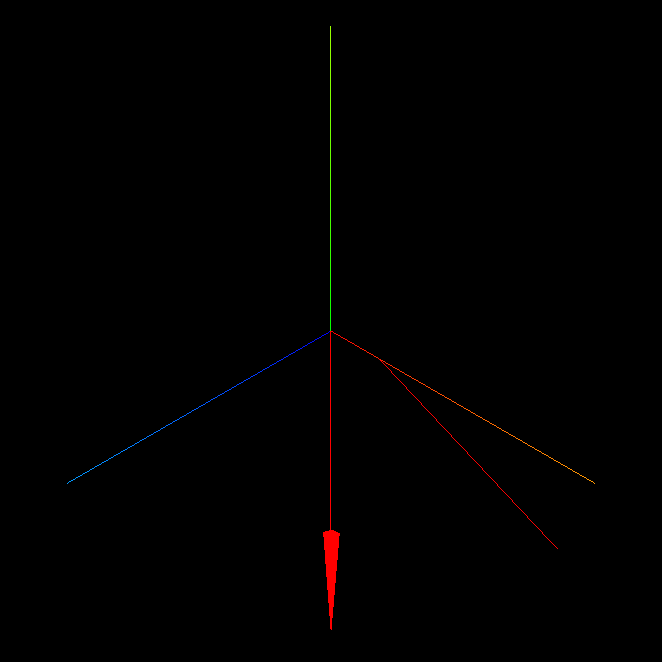

# Visual Log

Log geometric data to the browser console.

## Installation

```sh
npm i visual-log
```

## Usage

-   `id(newId: string)` the following objects will be added to the image with the id `newId`
-   `color(newColor: string)` the following objects will be of color `newColor`
-   `arrow(from: Vec3, to: Vec3)` add an arrow to the current image
-   `lineSegment(from: Vec3, to: Vec3)` add a line segment to the current image

### Example

```js
import * as vlog from "visual-log";

vlog.arrow([0, 0, 0], [3, 0, 3]);
vlog.lineSegment([1, 0, 0], [4, 0, 1]);
```

This outputs the following image to the console:


